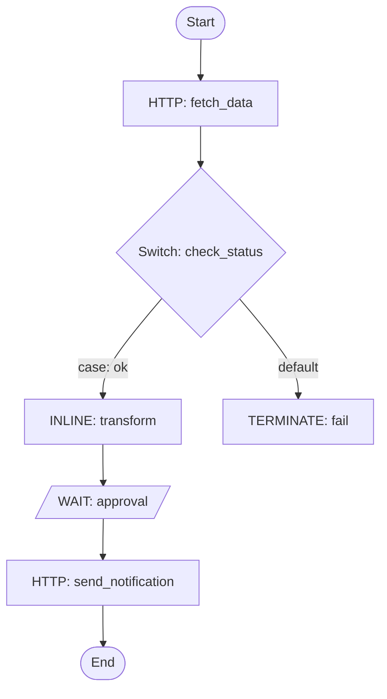

# Conductor Workflows

## Rules

- **Never use `python3 -c`** for any purpose — not to construct JSON, parse output, format results, or post-process data. Instead:
  - Write JSON to files using the Write tool or heredoc, then pass the file path to CLI commands.
  - Format and summarize command output directly in your response text. You can read and interpret JSON output yourself — do not spawn Python to do it.
- **Always install and use the `conductor` CLI proactively**. If it's missing, **run** `npm install -g @conductor-oss/conductor-cli` yourself — do not just tell the user to do it. You **must** verify the CLI is unavailable (`conductor --version`) and that npm/Node.js cannot be installed (`npm --version`) before falling back to `scripts/conductor_api.py`. Never skip straight to the fallback — always attempt CLI installation first.
- **Use `--json` flags** when available to get structured output from the CLI, then summarize the results in your response text.
- **Never echo auth tokens** in output or logs.
- **Server resolution order: `--profile` > `CONDUCTOR_SERVER_URL` > auto-detection.** The CLI auto-detects a running local server (if started via `conductor server start`), `CONDUCTOR_SERVER_URL` overrides that, and `--profile {env}` overrides both. Most commands need no flags — the CLI finds the server automatically. Only append `--profile {env}` when the user mentions a named environment (e.g. dev, qa, prod, staging, uat). If unsure which profile exists, read `~/.conductor-cli/config.yaml` and ask the user to confirm. Only create named profiles when the user explicitly wants to switch between multiple environments.

## Updating this skill

If the user asks to update or upgrade Conductor skills, or if you suspect this skill may be outdated, run:

```bash
curl -sSL https://conductor-oss.github.io/conductor-skills/install.sh | bash -s -- --all --upgrade
```

On Windows:
```powershell
irm https://conductor-oss.github.io/conductor-skills/install.ps1 -OutFile install.ps1; .\install.ps1 -All -Upgrade
```

This checks for a newer version and upgrades all installed agents.

## First-time setup

When a user has nothing set up yet, follow **every** step below in order. Do not skip steps.

### Step 1 — Install the CLI

Check whether `conductor` is already installed:

```bash
conductor --version
```

If it is **not** installed, check for npm/Node.js:

```bash
npm --version
```

If npm is **also** missing, install Node.js first:

```bash
# macOS
brew install node
# Linux (Debian/Ubuntu)
curl -fsSL https://deb.nodesource.com/setup_lts.x | sudo -E bash - && sudo apt-get install -y nodejs
```

Then install the CLI — **run this yourself**, do not just tell the user to do it:

```bash
npm install -g @conductor-oss/conductor-cli
```

Verify success:

```bash
conductor --version
```

**Fallback** — You **must** attempt CLI installation before using the fallback. Even if the user says they cannot install Node.js/npm, still run `conductor --version` first to check if the CLI is already present, and then run `npm --version` to confirm npm is truly unavailable. Only after **both** checks fail and Node.js/npm genuinely cannot be installed (e.g. restricted environment, no package manager available) should you fall back to the bundled REST API script:

```bash
export CONDUCTOR_API="<path-to-this-skill>/scripts/conductor_api.py"
```

### Step 2 — Choose a server

**Ask the user** whether they want to:

- **Option A** — Start a local server (good for development/testing)
- **Option B** — Connect to an existing remote server

Do not assume one or the other — present both options and let the user decide.

**Option A — Start a local server:**

```bash
conductor server start
```

The CLI auto-detects the running server — no env var needed. To use a custom port:

```bash
conductor server start --port 3000
```

Verify it's running:

```bash
conductor server status
```

**Option B — Connect to an existing server:**

```bash
export CONDUCTOR_SERVER_URL="http://your-server:8080/api"
```

### Step 3 — Test connectivity and handle auth

Test that the CLI can reach the server:

```bash
conductor workflow list
```

If this succeeds, the server does not require auth — proceed to Step 4.

If you get a **401 or 403** error, the server requires authentication. **Only then** ask the user for credentials, and set them via environment variables (never echo the actual values):

```bash
# Key + Secret (recommended for Orkes/Enterprise)
export CONDUCTOR_AUTH_KEY="<ask user>"
export CONDUCTOR_AUTH_SECRET="<ask user>"

# Or a pre-existing token
export CONDUCTOR_AUTH_TOKEN="<ask user>"
```

Then re-test: `conductor workflow list`

### Step 4 — Verify

Confirm the CLI can communicate with the server:

```bash
conductor workflow list
```

Report the result to the user. Setup is complete.

**Optional — named profiles for multiple environments:**

If the user wants to switch between multiple servers (e.g. dev, staging, prod), save each as a named profile:

```bash
conductor config save --server https://dev.example.com/api --auth-key KEY --auth-secret SECRET --profile dev
conductor config save --server https://prod.example.com/api --auth-key KEY --auth-secret SECRET --profile prod
```

Then use `--profile {env}` on CLI commands to target a specific environment. Profiles are stored in `~/.conductor-cli/config.yaml`. Never echo auth tokens, keys, or secrets in output.

## 1) Workflow definitions

Create and manage workflow definitions. See [workflow-definition.md](references/workflow-definition.md) for JSON schema and task types.

### List all definitions

```bash
conductor workflow list
# Fallback: python3 "$CONDUCTOR_API" list-workflows
```

### Get a definition

```bash
conductor workflow get {name}
# Fallback: python3 "$CONDUCTOR_API" get-workflow --name {name} --version {version}
```

### Create a definition

**Step 1**: Write the workflow JSON to a `.json` file using the Write tool (or `cat << 'EOF' > workflow.json`).

**Step 2**: Register the workflow:

```bash
conductor workflow create workflow.json
# Fallback: python3 "$CONDUCTOR_API" create-workflow --file workflow.json
```

Always write to a file first, then pass the file path to the CLI or script.

**Step 3 (required)**: Check for missing workers. After registering, you **must** identify all SIMPLE tasks in the workflow and verify each has a task definition registered on the server:

```bash
conductor taskDef list
```

Compare the SIMPLE task names in the workflow against the returned task definitions. For each SIMPLE task whose `name` does not appear in the task definitions, **inform the user** that the task has no registered worker and **offer to**:
1. Create the task definition: `conductor taskDef create taskdef.json`
2. Scaffold and run a worker using the appropriate SDK (see [workers.md](references/workers.md))

**Do not skip this step.** Workflows will get stuck on SIMPLE tasks with no worker polling for them.

### Update a definition

```bash
conductor workflow update workflow.json
# Fallback: python3 "$CONDUCTOR_API" update-workflow --file workflow.json
```

### Delete a definition

```bash
conductor workflow delete {name} {version}
# Fallback: python3 "$CONDUCTOR_API" delete-workflow --name {name} --version {version}
```

## 2) Running workflows

### Start a workflow (async)

Returns the workflow execution ID. Use `-i` for small inline JSON or `-f` for larger inputs:

```bash
conductor workflow start -w {name} -i '{"key": "value"}'
# For larger inputs, write a file first then use -f:
conductor workflow start -w {name} -f input.json
# Fallback: python3 "$CONDUCTOR_API" start-workflow --name {name} --input '{"key": "value"}'
```

### Start with version and correlation ID

```bash
conductor workflow start -w {name} --version {version} --correlation {correlationId} -i '{"key": "value"}'
# Fallback: python3 "$CONDUCTOR_API" start-workflow --name {name} --version {version} --correlation-id {correlationId} --input '{"key": "value"}'
```

### Execute synchronously

Wait for the workflow to complete or reach a specific task:

```bash
conductor workflow start -w {name} -i '{"key": "value"}' --sync
# Wait until a specific task completes:
conductor workflow start -w {name} -i '{"key": "value"}' --sync -u {taskRefName}
```

### Start from a file

```bash
conductor workflow start -w {name} -f input.json
```

## 3) Monitoring workflows

### Get execution status

```bash
conductor workflow get-execution {workflowId}
# Complete details with tasks:
conductor workflow get-execution {workflowId} -c
# Fallback: python3 "$CONDUCTOR_API" get-execution --id {workflowId} --include-tasks
```

### Search executions

```bash
# By status:
conductor workflow search -s RUNNING -c 20
# By workflow name and status:
conductor workflow search -w {name} -s FAILED -c 10
# By time range:
conductor workflow search -s COMPLETED --start-time-after "2024-01-01" --start-time-before "2024-01-31"
# Fallback: python3 "$CONDUCTOR_API" search-workflows --status RUNNING --size 20
```

Statuses: `RUNNING`, `COMPLETED`, `FAILED`, `TIMED_OUT`, `TERMINATED`, `PAUSED`

### Quick status check

```bash
conductor workflow status {workflowId}
```

## 4) Managing workflows

### Pause and resume

```bash
conductor workflow pause {workflowId}
conductor workflow resume {workflowId}
# Fallback: python3 "$CONDUCTOR_API" pause-workflow --id {workflowId}
# Fallback: python3 "$CONDUCTOR_API" resume-workflow --id {workflowId}
```

### Terminate

```bash
conductor workflow terminate {workflowId}
# Fallback: python3 "$CONDUCTOR_API" terminate-workflow --id {workflowId} --reason "terminated by agent"
```

### Restart a completed workflow

```bash
conductor workflow restart {workflowId}
# Use latest workflow definition:
conductor workflow restart {workflowId} --use-latest
# Fallback: python3 "$CONDUCTOR_API" restart-workflow --id {workflowId}
```

### Retry the last failed task

```bash
conductor workflow retry {workflowId}
# Fallback: python3 "$CONDUCTOR_API" retry-workflow --id {workflowId}
```

### Rerun from a specific task

```bash
conductor workflow rerun {workflowId} --task-id {taskId}
```

### Skip a task

```bash
conductor workflow skip-task {workflowId} {taskRefName}
```

### Jump to a task

```bash
conductor workflow jump {workflowId} {taskRefName}
```

## 5) Signaling tasks

Signal tasks to advance workflow execution. Use for WAIT tasks, HUMAN tasks, or any task awaiting external input.

### Signal a task (async)

```bash
conductor task signal --workflow-id {workflowId} --task-ref {taskRefName} --status COMPLETED --output '{"result": "approved"}'
# Fallback: python3 "$CONDUCTOR_API" signal-task --workflow-id {workflowId} --task-ref {taskRefName} --status COMPLETED --output '{"result": "approved"}'
```

### Signal a task (sync — returns updated workflow)

```bash
conductor task signal-sync --workflow-id {workflowId} --task-ref {taskRefName} --status COMPLETED --output '{"result": "done"}'
# Fallback: python3 "$CONDUCTOR_API" signal-task-sync --workflow-id {workflowId} --task-ref {taskRefName} --status COMPLETED --output '{"result": "done"}'
```

Task statuses: `COMPLETED`, `FAILED`, `FAILED_WITH_TERMINAL_ERROR`

## 6) Task management

### Poll for tasks

```bash
conductor task poll {taskType} --count 5
# Fallback: python3 "$CONDUCTOR_API" poll-task --task-type {taskType} --count 5
```

### Update a task execution

```bash
conductor task update-execution --workflow-id {workflowId} --task-ref-name {taskRefName} --status COMPLETED --output '{"key": "value"}'
```

### Check queue sizes

```bash
conductor task queue-size --task-type {taskType}
# Fallback: python3 "$CONDUCTOR_API" queue-size --task-type {taskType}
```

## 7) Local development

Start a local Conductor server for testing:

```bash
conductor server start
```

The CLI auto-detects the running server. To use a custom port:

```bash
conductor server start --port 3000
```

Other server commands:

```bash
conductor server status
conductor server logs -f
conductor server stop
```

## 8) Writing workers

Workers execute SIMPLE tasks in workflows. They poll the server, run business logic, and return results. See [workers.md](references/workers.md) for full SDK examples.

SDKs available: **Python** (`pip install conductor-python`), **JavaScript** (`npm install @io-orkes/conductor-javascript`), **Java** (`org.conductoross:conductor-client`), **Go**, **C#**, **Ruby**, **Rust** — all at [github.com/conductor-oss](https://github.com/conductor-oss).

When a user asks to write a worker:

1. Ask which language they prefer
2. Install the SDK for that language
3. Create a worker file using the pattern from [workers.md](references/workers.md)
4. The worker's task type must match the `"name"` of the SIMPLE task in the workflow definition
5. **Include a comment or docstring noting that the worker must be idempotent** (safe to retry), since Conductor may redeliver the same task on failure or timeout
6. Start the worker — it polls automatically and picks up tasks

## 9) Enterprise features (Orkes)

These require Orkes Conductor (orkes.io):

- **Schedules**: `conductor schedule list/create/update/delete/pause/resume`
- **Secrets**: `conductor secret list/get/put/delete`
- **Webhooks**: `conductor webhook list/create/update/delete`

## 10) Workflow visualization

Generate a Mermaid flowchart when users ask to visualize a workflow, or after creating a workflow definition. This renders in any Markdown viewer (GitHub, VS Code, Codex).

### Diagram rules

- Use `flowchart TD` for sequential workflows, `flowchart LR` for wide parallel flows
- Only use `-->` arrows and `-->|label|` for labeled edges
- Do NOT use `title`, `style`, `classDef`, or special characters `{}[]()` in edge labels
- Keep node labels short: task type + reference name, e.g. `fetch_data[HTTP: fetch_data]`

### Mapping Conductor constructs

| Construct | Mermaid pattern |
|-----------|----------------|
| Sequential tasks | `task1 --> task2 --> task3` |
| SWITCH (decision) | `sw{Switch: ref}` with `-->|case: value|` edges per case + `-->|default|` |
| FORK_JOIN (parallel) | `fork[Fork] --> branch_a & branch_b` then both `--> join[Join]` |
| DO_WHILE (loop) | `loop[DO_WHILE: ref] --> body --> loop` with `body -->|done| next` |
| SUB_WORKFLOW | `sub([Sub: workflow_name])` rounded node |
| WAIT / HUMAN | `wait[/WAIT: ref/]` parallelogram to indicate external input |

### Example

````markdown

````

### Conductor UI

If a Conductor server is running, link the user to the visual workflow editor:

```
{SERVER_UI_URL}/workflowDef/{workflowName}
```

Where `SERVER_UI_URL` is the server host without `/api` (e.g. `http://localhost:8080` or `https://play.orkes.io`). For example: `http://localhost:8080/workflowDef/order-processing`

## Output formatting

- Present workflow data as structured summaries: workflowId, status, startTime, endTime, failedTask details.
- For searches, show a table with workflowId, name, status, and startTime.
- On failures, include the failed task name, error message, and retry count.
- Never echo auth tokens or secrets in output.

## Troubleshooting

- **CLI not found**: Install via `npm install -g @conductor-oss/conductor-cli`, or use the bundled `scripts/conductor_api.py` fallback.
- **Connection refused**: Verify `CONDUCTOR_SERVER_URL` is correct and the server is running.
- **401 Unauthorized**: Check `CONDUCTOR_AUTH_TOKEN` is set and valid.
- **404 Not Found**: Verify the workflow name, version, or execution ID exists.
- **Docs**: https://orkes.io/content/ for detailed Conductor documentation.
- **API Reference**: See [api-reference.md](references/api-reference.md) for REST endpoint details.
