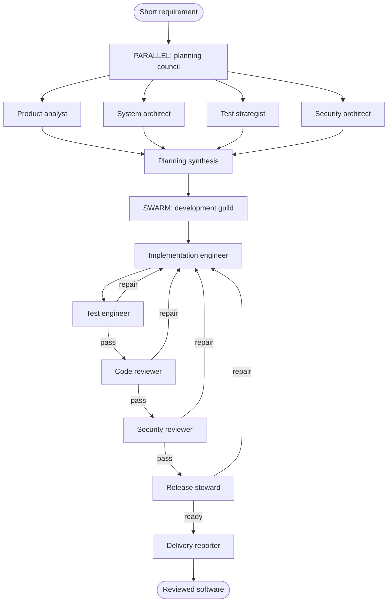

# Software Society

A deployable Conductor Agent society that turns a two- or three-line requirement into reviewed software in a constrained workspace. Conductor persists every specialist turn, tool call, approval, retry, and handoff as workflow state.

## Society structure

The planning council analyzes the brief in parallel. Its implementation contract feeds a development swarm whose specialists can hand failed work back for repair. A fresh delivery reporter then verifies the actual workspace and produces the final report.



## Safety and cost boundaries

- Every agent has an explicit turn limit and wall-clock timeout; the caller has `maxDurationSeconds` and a workflow timeout.
- All paths are relative to `SOFTWARE_SOCIETY_WORKSPACE`; traversal, `.git` access, deletion, arbitrary shell, and files over 200 KB are rejected.
- `apply_change_set` writes complete files atomically and idempotently, is capped at eight calls, and requires human approval.
- `run_quality_checks` only runs fixed profiles (`pytest`, `npm test`, `go test`, `cargo test`, Gradle, Maven, or `dotnet test`), is capped, and requires approval because generated tests execute code.
- Read tools never need approval. Provider credentials remain on the Conductor server.

## Install and configure

The scaffold is pinned to the current published Python SDK verified while it was generated:

```bash
python -m venv .venv
source .venv/bin/activate
pip install -r requirements.txt

export CONDUCTOR_SERVER_URL=http://localhost:8080/api
export SOFTWARE_SOCIETY_MODEL=openai/gpt-4o-mini
export SOFTWARE_SOCIETY_WORKSPACE=/absolute/path/to/the/project
```

The server must have the selected provider configured (`OPENAI_API_KEY` for the default model). Do not put provider keys in this client or workflow input.

## Test offline

```bash
PYTHONPATH=. pytest -q
```

These tests validate the nested strategies and bounds, approval metadata, workspace isolation, and idempotent writes without a server or LLM.

## Try one brief locally

```bash
PYTHONPATH=. python run.py --brief-file brief.example.txt
```

The run pauses before each file mutation or quality-check execution. Inspect the pending tool call, then approve or reject it using the returned execution ID:

```bash
conductor agent respond EXECUTION_ID --approve
conductor agent stream EXECUTION_ID
```

Approval is intentionally not sent through an `AGENT` resume prompt; the gate expects the deterministic approval channel.

## Production lifecycle

Compile first and inspect the worker gate:

```bash
PYTHONPATH=. python deploy.py --plan-only
```

Deploy once in CI, then keep the worker process alive as a service:

```bash
PYTHONPATH=. python deploy.py
PYTHONPATH=. python serve.py
```

The verified plan requires seven workers: `inspect_workspace`, `read_workspace_file`, `search_workspace`, `workspace_diff`, `apply_change_set`, `run_quality_checks`, and the generated `software_development_swarm_termination`. `serve.py` serves the complete set; without it, executions will remain scheduled.

## Invoke it from another workflow

The workflow contains no `SIMPLE` tasks, so the ordinary workflow worker gate is empty. Its deployed agent still requires the Python and compiler-generated workers reported by `deploy.py --plan-only`.

```bash
conductor agent list
conductor workflow create workflows/software-society.json
conductor workflow start -w software_society_delivery \
  -i '{"brief":"Build a CLI that validates JSON files and prints useful errors. Include tests.","conductorApi":"http://localhost:8080/api"}'
```

When a mutating or execution tool needs approval, the parent workflow pauses on
`approve_agent_tool_ref`. Inspect its `pendingTool`, then complete that HUMAN
task with `{"approved": true}` (or `false`) in the UI or with
`conductor task update-execution`. The bounded loop sends the deterministic
approval response to the child, handles later approval gates the same way, and
does not complete until the child is terminal.

## Files

- `software_society/agents.py` — nested parallel, swarm, and sequential agent graph.
- `software_society/tools.py` — constrained, retry-safe workspace workers.
- `run.py` — one local execution.
- `deploy.py` — compile/worker-gate inspection and deployment.
- `serve.py` — long-lived Python worker service.
- `workflows/software-society.json` — workflow entry point using the built-in `AGENT` task.
- `tests/test_society.py` — offline structural and safety contracts.
