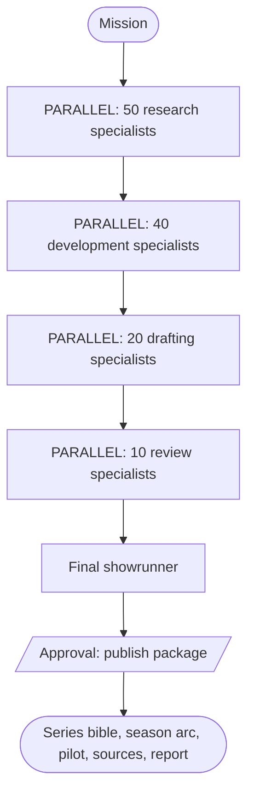

# Bengaluru Writers' Room

This example deploys an original-fiction writers' society as six phase-isolated
native Conductor agents and invokes them from one durable workflow. It contains
120 numbered specialists, split evenly between OpenAI and Anthropic models,
plus department directors, federation directors, a final showrunner, and an
approval-gated publisher (138 agent objects in total).

The working title is **Namma Stack**. It is an original Bengaluru technology
workplace satire, not an adaptation or imitation of HBO's *Silicon Valley*.
Every agent receives an originality charter forbidding reuse of protected
characters, companies, dialogue, plots, signature scenes, catchphrases, and
branding.

## Architecture

Five research departments run 50 specialists in parallel. Four development
departments then run 40, two drafting departments run 20, and a ten-member
review board audits the result. Each department director synthesizes its ten
independent memos, and each federation synthesizes its departments. The workflow
passes only each compact phase result to the next independently deployed agent;
it never nests all prior execution context into the next phase. This keeps the
compiled agent state below Conductor's 256 KB workflow-variable limit.



The six model IDs are environment-overridable. The defaults were selected from
the current official model catalogs when this example was written:

- OpenAI: `gpt-6-astra`, `gpt-5.6-terra`, and `gpt-5.6-luna`
- Anthropic: `claude-fable-5-1`, `claude-opus-5`, and `claude-sonnet-5`

Research agents can discover and read bounded public web sources. Their tools
reject local/private networks, credentials in URLs, oversized responses, and
unsafe redirects. Web content is explicitly treated as untrusted evidence.
No agent receives arbitrary shell or code-execution access because it is not
needed to create the story. Artifact publishing is path-confined, atomic,
idempotent, Markdown-only, and requires human approval.

## Cost warning

A complete bootstrap executes at least 120 specialist model turns, 12
department syntheses, four federation syntheses, a showrunner pass, and a
publisher pass. Tool use and retries can add more calls. Validate with
`deploy.py --plan-only`, use the model override environment variables if
needed, and launch a full run only when that spend and runtime are acceptable.

## Install and configure

The current Python Agent SDK install documented by the official SDK is
`conductor-python[agents]`. This example pins the tested release in
`requirements.txt`.

```bash
cd skills/conductor/examples/bengaluru-writers-room
python3 -m venv .venv
source .venv/bin/activate
pip install -r requirements.txt
cp .env.example .env
```

Export the values in `.env` in the shell that runs these commands. Provider
credentials belong on the Conductor server (`OPENAI_API_KEY` and
`ANTHROPIC_API_KEY`), never in workflow inputs or source files.

## Test, deploy, and serve

```bash
pytest -q
python deploy.py --plan-only
python deploy.py
python serve.py
```

`deploy.py --plan-only` prints the full agent count and the exact worker types
the compiled society requires. `serve.py` must remain running to serve those
bounded research and artifact tools.

## Register and run through a workflow

In another shell connected to the same Conductor server:

```bash
conductor workflow create workflows/bengaluru-writers-room.json
conductor task list --json
conductor workflow start -w bengaluru_writers_room_delivery -f mission-input.json
```

Example `mission-input.json`:

```json
{
  "mission": "Bootstrap an original Bengaluru technology workplace comedy. Develop the series bible, the ten-episode first-season arc, and a complete pilot teleplay suitable for a table read.",
  "conductorApi": "http://localhost:8080/api"
}
```

The workflow definition contains no `SIMPLE` tasks, so its workflow worker gate
is empty. The Python agent deployment has a separate worker gate: every entry
reported by `deploy.py --plan-only` must be served by `serve.py`.

The publisher pauses at the workflow's `approve_story_package_ref` HUMAN task.
Inspect its `pendingTool`, then complete it with `{"approved": true}` in the UI
or with `conductor task update-execution`; the workflow sends the deterministic
approval response to the child agent and keeps polling until it finishes. By default the
accepted package is written beneath `/tmp/namma-stack-writers-room`; override
that location with `WRITERS_ROOM_WORKSPACE`.

The minimum delivery package is:

- `series/series_bible.md`
- `series/season_01_arc.md`
- `episodes/s01e01_pilot.md`
- `research/sources.md`
- `production/delivery_report.md`

## Convenience launcher

After registering the workflow, the launcher starts it asynchronously:

```bash
python run.py --mission-file mission.example.txt \
  --conductor-api http://localhost:8080/api
```

The workflow owns phase sequencing and approval; invoking a single nested root
agent is intentionally unsupported because it recreates the recursive-context
payload failure this example is designed to avoid.
