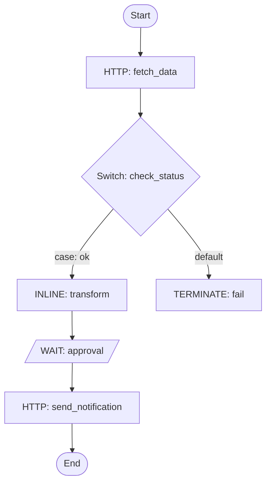

# Workflow Visualization

Generate a Mermaid flowchart when the user asks to visualize a workflow, or after creating one. Renders in any Markdown viewer (GitHub, VS Code, etc.).

## Diagram rules

- Use `flowchart TD` for sequential workflows, `flowchart LR` for wide parallel flows.
- Only use `-->` arrows and `-->|label|` for labeled edges.
- Do **not** use `title`, `style`, or `classDef`.
- In **edge label text** (between `|...|`), avoid `{}[]()` — they break Mermaid parsing. Node shapes (`[]`, `()`, `{}`) are fine; just keep the text inside short.
- Keep node labels short: task type + reference name, e.g. `fetch_data[HTTP: fetch_data]`.

## Mapping Conductor constructs

| Construct | Mermaid pattern |
|-----------|-----------------|
| Sequential tasks | `task1 --> task2 --> task3` |
| SWITCH (decision) | `sw{Switch: ref}` with `-->|case: value|` edges per case + `-->|default|` |
| FORK_JOIN (parallel) | `fork[Fork] --> branch_a & branch_b` then both `--> join[Join]` |
| DO_WHILE (loop) | `loop[DO_WHILE: ref] --> body --> loop` with `body -->|done| next` |
| SUB_WORKFLOW | `sub([Sub: workflow_name])` rounded node |
| WAIT / HUMAN | `wait[/WAIT: ref/]` parallelogram (signals external input) |

## Example

````markdown

````

## Conductor UI link

If a Conductor server is reachable, also offer a link to the visual editor:

```
{BASE_URL}/workflowDef/{workflowName}
```

Where `BASE_URL` is `CONDUCTOR_SERVER_URL` with the trailing `/api` stripped. Example: `http://localhost:8080/api` → `http://localhost:8080/workflowDef/order-processing`. Always resolve the actual URL — never output `{SERVER_UI_URL}` literally.
